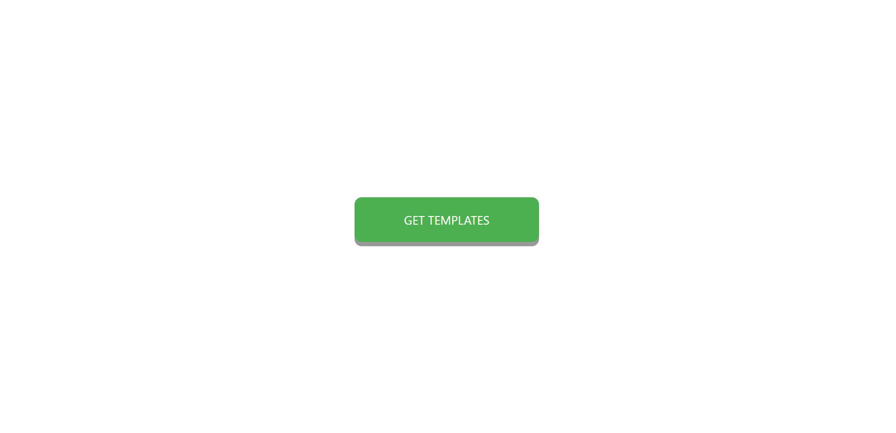
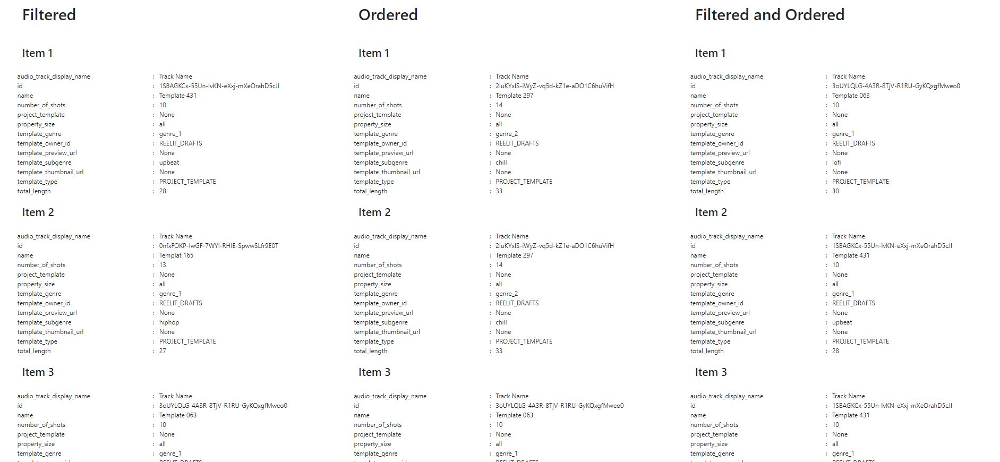
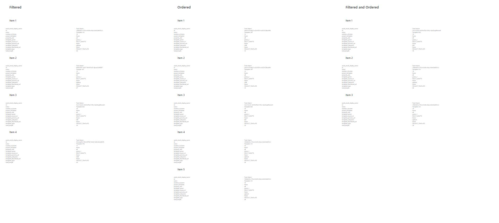
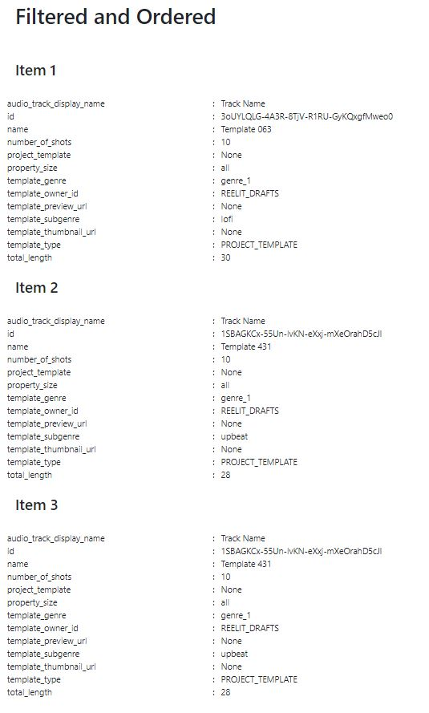
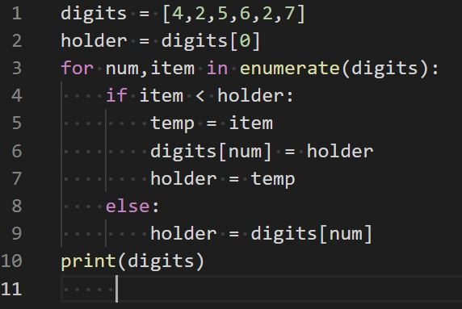

### Hello Reelit Team.

### Requirements Fulfilled:

##### Home page with button in the center that links to a filtered and ordered JSON file:

##### Results of the JSON file displayed with html and CSS:

##### The total results fully expanded to view in one page:

##### The minimum requirements delivered:

### Instruction to try and set up the app on your personal computer:

Please take note that the pip3 list is larger then expected. Mainly because I built a template so there is alot of packages installed.

| Instructions | command |
|---|---|
| Update Repository | sudo apt-get update |
| Install python3.8 | sudo apt-get install python3.8 |
| Install pip | sudo apt install python3-pip |
| Set up virtual environment | python3 -m venv venv |
| Install pip requirements | pip3 install -r requirements.txt |
| Move into the src file | cd src |
| Set up flask environment variables | export FLASK_APP="main:create_app()" |
| Set up flask mode | export FLASK_ENV="development" |
| Run the app | flask run |
| Open a google chrome web browser | localhost:5000/home |

### How I first designed how the system would work:

I have built a few websites now that utilise json and buttons. For this task I did not really plan the task. I instantly new that I can import a button from bootstrap and use CSS flexbox to justify and align the button into the middle of the body of the webpage as long as I set the body to viewport height and viewport width.  Sending an array via a python list is something I am very comfortable with aswell. So I mapped it out in my head. I knew if I get stuck that I have the code available for my old website that I can refer to. On bigger tasks I may write pseudo code. I have also completed wireframes and ERD's for bigger websites.

### What sources I used to repurpose:

I have built myself a website template that is built in an MVC architecture pattern that I have stored on my personal computer. I am refining the website template more and more every project. So you could call that a repurpose website template. You can check the source code at https://github.com/ScottBurleighHeads/Website_template. Also I rely on bootstrap with a bit of CSS for designing user interfaces. I am sure you guys are aware of bootstrap already but if not it is a source for pre-built CSS and Javascript.

### Problems I encounted

The sorting algorithm is a fairly simple algorithm but when trying to implement the algorithm with a dictionary I was not getting the result I was expecting. It was difficult to build a mind map of what would be a simple algorithm when using dictionary variables because they can be so long. I was not getting the results I was expecting so and I could not visualise where I was making the mistake. What I do when I have these problems is build a very simple program outside of the file then substitute the big variable names in. 

### Decisions where you used one method over another

I went straight to using the MVC architecture because I have built my website template. I also wanted to prove I can build to a standard where an application can be upgradeable, maintainable and tested. I wanted to modularise the software to show that if working with a more complex application I can build to large scales. I could of build this app extremely simple with two or three pages of code because it is a test and will not be re-used or updated.

### How long it took you

Actually spent a bit of time on it. The algorithm was simple but implementing the front-end technology is not second nature to me. I had no wireframes to work from so I had to try a few different looks. That required playing with the CSS and bootstrap. I also did some research on decent looking buttons considering that was all that was requested for the first page. I probably spent 5hrs building the program to finished and now another 3hrs writing up the README.md file.

### Changes you would've like to make if you had more time

Maybe look into designing more interactive functions with the button. It is very simple. 

### Features you would like to add

I was considering displaying the data in a bootstrap carousel. I think it would make the data a little clearer to interpret and a little user friendly. 

### Any other notes to help evaluate

I constantly enjoy learning. I am currently teaching myself Javascript through codecademy. I try and answer a codewars challenge everyday. I am reading through Software Engineering 10th edition by Ian Sommerville. I have multiple personal projects I am building for myself such as my portfolio, upgrade my girlfriends website. She wants a database built with a blog. My dad wants a website to teach people how to sell their own business's. I am constantly building on what I know. I genuinly have a passion for software development.
